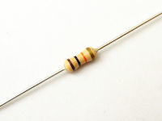

{:toc}

# 在庫
## Arduino
* Arduino UNO

## 抵抗

* 0,1,4.7,10,47,51,75,100,120,150,180,200,220,240,270,300,330,390,470,510,560,680,750,820
* 1k,1.2k,1.5k,1.8k,2k,2.2k,2.4k,2.7k,3k,3.3k,3.9k,4.7k,5.1k,5.6k,6.8k,7.5k,8.2k,9.1k,10k,12k,15k,18k,22k,24k,27k,30k
* 33k,39k,47k,51k,68k,100k,120k,150k,180k,200k,220k,330k,470k,510k,680k,750k,1M
各10

* 1k,4.7k,10k,20k,100k
各100

## コンデンサ
* 50V/0.1μF

## ダイオード
* ツェナーダイオード 3.3V

## LED
* 赤
* 黄
* 緑
* 赤/青
各10

## スイッチ
* 押しボタン x10
* 切り替え x1

## IC
* オーディオアンプ NJM2073D x 4

## ディスプレイ
* ７セグ

## 工具

* 半田ごて x2
* ブレッドボード
* ドライバー各種
* テスター
* ポスカ

